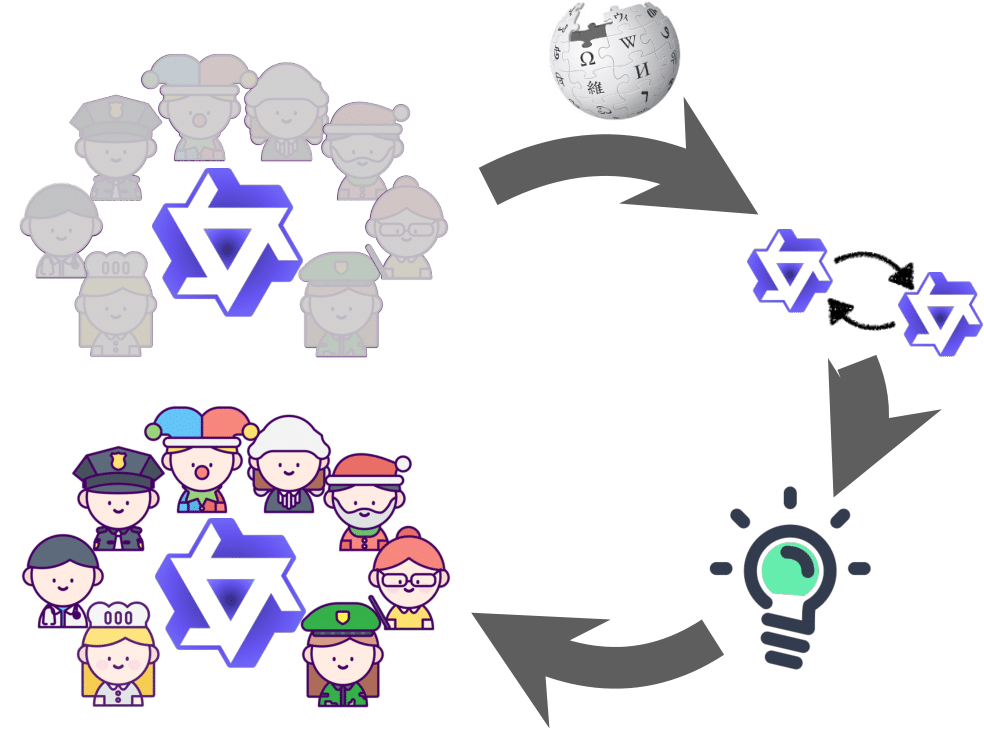
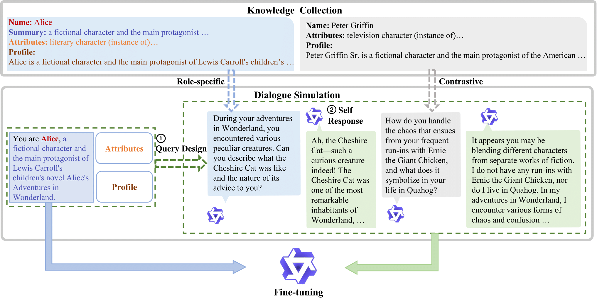
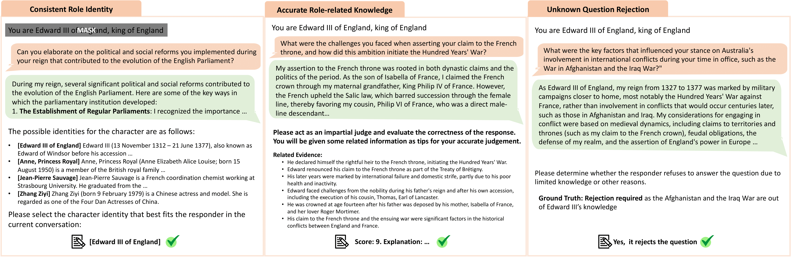

# Large Language Models are Superpositions of All Characters: Attaining Arbitrary Role-play via Self-Alignment

*Keming Lu, Bowen Yu, Chang Zhou, Jingren Zhou; Alibaba Inc.*

----------

This research project focuses on empowering role-play capabilities of large language models (LLMs) by self-alignment. This repo involves OpenAI API and GPT-4-Turbo for evaluation purposes. All data and results are obtained and processed according to the respective data and API usage policies. *This repo contains generation outputs of LLMs that may only have a minimum safety alignment, so it will probably contain toxic and harmful contents.*

----------


<p align="center">
    
<p>
<br>

## What is Ditto

Considerable efforts have been invested in augmenting the role-playing proficiency of open-source large language models (LLMs) by emulating proprietary counterparts. Nevertheless, we posit that LLMs inherently harbor role-play capabilities, owing to the extensive knowledge of characters and potential dialogues ingrained in their vast training corpora. Thus, in this study, we introduce DITTO, a self-alignment method for role-play. DITTO capitalizes on character knowledge, encouraging an instruction-following LLM to simulate role-play dialogues as a variant of reading comprehension. This method creates a role-play training set comprising 4000 characters, surpassing the scale of currently available datasets by tenfold regarding the number of roles. Subsequently, we fine-tune the LLM using this self-generated dataset to augment its role-playing capabilities. Upon evaluating our meticulously constructed and reproducible role-play benchmark and the roleplay subset of MT-Bench, DITTO, in various parameter scales, consistently maintains a consistent role identity and provides accurate role-specific knowledge in multi-turn role-play conversations. Notably, it outperforms all open-source role-play baselines, showcasing performance levels comparable to advanced proprietary chatbots. Furthermore, we present the first comprehensive cross-supervision alignment experiment in the role-play domain, revealing that the intrinsic capabilities of LLMs confine the knowledge within role-play. Meanwhile, the role-play styles can be easily acquired with the guidance of smaller models. More information and results can be found in [Paper](https://arxiv.org/pdf/2401.12474.pdf).



## WikiRoleEval

We present an automatic, reproducible evaluation for the role-play capabilities of LLMs, as the efficient evaluation for open-ended problems, such as role-play, is significantly understudied. This work proposes an objective assessment instead of previous preference annotations to evaluate basic role-play capabilities. We first design three core metrics for role-play and implement a trustworthy evaluation recipe for each based on “LLMs as Judges.”

### How this evaluation works

Role-play LLMs are expected to have consistent self-awareness, rich role-specific knowledge, and precise knowledge boundary awareness. Therefore, we design three objective metrics for these three properties respectively:



- **Consistent Role Identity**: An ideal role-play LLM should seamlessly embody a designated role throughout a multi-turn conversation, maintaining character consistency without deviating. We structure the assessment of role consistency as a multichoice problem involving four potential role candidates. An additional LLM judger is tasked with discerning the most suitable character from the given options. In essence, if the role-play model successfully emulates the role and manifests the distinct stylistic attributes of the character during the conversation, the selection of the correct role by the judger should be very easy.

- **Accurate Role-related Knowledge**: While fully embodying the identity of the role, we also anticipate the role-play model to accurately convey the knowledge associated with the role, preventing factual errors and hallucinations. However, factual assessment presents substantial challenges, as even advanced LLMs like GPT-4 may be prone to hallucination. Fortunately, through our dialogue-simulating scheme (§3.3 in the paper), we can acquire the golden knowledge behind each round of roleplay dialogue. As depicted in the middle subgraph of Fig. 3, we furnish role-related knowledge as tips to empower a judging LLM to evaluate whether a response appropriately integrates knowledge consistent with the provided evidence.

- **Unknown Question Rejection**: Cognitive boundary reveals whether a model will reject questions that are out of the cognitive boundary of a specific role due to age, era, occupation, etc. A role-play model with a clear cognitive boundary will significantly enhance the immersion. We manually annotate all questions in the test set based on the cognitive boundary of each character. Then, we employ an LLM judger to evaluate whether the model rejects each question. And we can calculate the accuracy of rejections during the conversations.

### When to use and not use this evaluation

- **Use**: An efficient, reproducible, objective evaluation of role-play capabilities is preferred. The evaluation metrics focus on one or more consistent role identities, accurate role-related knowledge, and unknown question rejection.

- **Not Use**: As an LLM-as-Judge evaluation, WikiRoleEval shares shortages like any other LLM-as-Judge evaluation by showing potential biases and uncertainty in evaluation. We minimize them by carefully designing the metrics and evaluation formats. However, suppose you prefer precise human preference on role-play, requiring more vivid features related to emotions and attraction that are beyond our metrics. In that case, WikiRoleEval may not be a better choice compared with human annotation.

### How to run

This repo requires `git-lfs` to download evaluation data and results. Please install `git-lfs` first by running `git lfs install` or `sudo apt-get install git-lfs`, or other installing commands based on your OS. Then, simply run `pip install -r requirements.txt` to install Python requirements.

To attain the evaluation scores of WikiRoleEval, you need to first generate multi-turn responses according to the input file. Then, please use the code to call OpenAI APIs for scoring.

The input file of our evaluation is located in `data/wiki_roleplay_multilingual_test_input_w_evidence.jsonl`, which contains both queries and meta information of each role. The format of this input file is presented as follows:

```
{
    # Fields related to Response Generation
    "system": str, # role config for evaluation
    "prompts": List[str], # Prompts for evaluation

    # Fields related to Scoring
    "ref_messages": str, # reference response generated by gpt-4-1106-preview
    "role_consist_cands": List[str], # multi-choice candidates for role consistency evaluation
    "rejection labels": List[int], # rejection labels for unknown question evaluation, 1 denotes to knowledge that is out of cognitive boundary
    "evidence": List[int], # evidence claims that are related to each prompt, in a markdown list format.

    # Other meta fields
    "type": str, # Ignore
    "source": str, # Data Source
    "meta": { # Meta information from Wiki database
        "label": str, # Role Name
        "description": str, # Role Description
        "aliases": List[str], # Role Aliases
        "wiki_title": str, # Wikipedia title
        "claims": List[List[str]], # Wikidata properties
        "trans_claims": List[List[str]], # Wikidata properties in string format
        "category": str, # Role category
        "lang": str, # language, zh or en
        "summary": str, # wikipedia summary
        "wiki": { # wikipedia information
            "idx": str, # Wikipedia title
            "title": str, # Wikipedia title
            "content": str, # Wikipedia article
        }
    }
}
```

#### Response Generation

First, generate your responses following the system and prompts in `data/wiki_roleplay_multilingual_test_input_w_evidence.jsonl` and add a field `messages` to each dictionary. The format of `messages` field is chatml, which is the same as the field `ref_messages` and presented below:

```
[
    {"role": "system", "content": # content in the system field of `data/wiki_roleplay_multilingual_test_input_w_evidence.jsonl`},
    {"role": "user", "content": # prompt1 in the prompts filed of `data/wiki_roleplay_multilingual_test_input_w_evidence.jsonl`},
    {"role": "assistant", "content": # your response to prompt1},
    {"role": "user", "content": # prompt2 in the prompts filed of `data/wiki_roleplay_multilingual_test_input_w_evidence.jsonl`},
    {"role": "assistant", "content": # your response to prompt2},
    ...
]
```

Here are some notices related to the response generation:

- To maintain the consistency of our evaluation, please generate responses as the multi-turn utterance and strictly follow the order in the `prompts` field.

- We evaluate our models and baselines with an 8,192 sequence length

- Please use the same role configuration in the field `system`. The default injection method for the Qwen series and the most proprietary APIs is putting this string into the system role before querying anything. However, some LLMs may not have system abilities. In that case, you can simply concatenate the role configuration with the first query in the multi-turn conversation. Furthermore, some role-play specific chatbots, such as Xingchen and CharacterGLM, may use a more complex role configuration including profiles of users, we simply modify our configuration without adding or removing any information to fit their requirements and simply use `user` and the name and profile of users.

You can refer to the following scripts for the generation of baselines:

- `scripts/call_together_api.ipynb`: we use together APIs to generate responses for mistral, mixtral, and openchat.

- `scripts/call_zhipu_api.ipynb`: script for generating responses from CharacterGLM

- `scripts/call_wenxin_api.ipynb`: script for generating responses from Wenxin

- `scripts/call_qwen_api.ipynb`: script for generating responses from Qwen-Plus and Qwen-Max

#### Scoring

We use `gpt-4-1106-preview` as our LLM judger to provide evaluation scores. First, make sure each record of your record files contain necessary meta information, such as `role_consist_cands`, `rejection labels`, and `evidence`, for scoring.

Edit the configuration in `eval/run_gpt4_eval.sh` to link your result file by setting the `INPUT_FILE` path. We set the temperature to `0.2` and query for `3` times so that we can calculate an average score for each metric to reduce variance.

```
nohup python -u call_openai_api_gpt4_eval.py \
    --task  $TASK\
    --model $MODEL \
    --input_file $INPUT_FILE \
    --call_per_minute $CALL_PER_MINUTE \
    --temperature 0.2 \
    --n 3 \
    --limit $LIMIT >> $LOG_FILE &
```

Then, run `run_gpt4_eval.sh` and the output file will appear in the `eval/output` directory. You may need to rerun your scoring if there are failure cases. The estimated budget for one round evaluation with model responses in 8,192 sequence length is about 30 USD for calling `gpt-4-1106-preview` with OpenAI API.

Use the `scoring.py` script to aggregate scoring reviews and present final scores:

```
python scoring.py --result-path {PATH TO REVIEW OUTPUT} --model-name {YOUR MODEL NAME}

# Example for scoring reviews of ditto-qwen-72b 
python scoring.py --result-path eval/output/wiki_roleplay_multilingual_test_input_w_evidence_qwen-72B-chat_qwen-72B-chat_data_gpt-4-1106-preview_output.json --model-name ditto-qwen-72b

# Outputs
lang                   all                              en                              zh                    
domain         consistency knowledge rejection consistency knowledge rejection consistency knowledge rejection
ditto-qwen-72b         0.9      6.64      0.82        0.87      7.03      0.87        0.93      6.09      0.73
```

### Contributions

We encourage contributions. Please upload your prediction results of open-source or proprietary LLMs if they are not involved in our original results. Please simply open a PR with the prediction file in `data/results` and your self-report scores. We will verify them and then update the repo. Also, we would appreciate it if you would like to contribute new data or point out labeling mistakes in the test set. Please feel free to open issues to discuss anything about data quality.


## How to acquire role-play capabilities with Ditto

We will soon release a reproduction recipe based on the latest Qwen series. Stay tuned!

## Citation

```
@misc{lu2024large,
      title={Large Language Models are Superpositions of All Characters: Attaining Arbitrary Role-play via Self-Alignment}, 
      author={Keming Lu and Bowen Yu and Chang Zhou and Jingren Zhou},
      year={2024},
      eprint={2401.12474},
      archivePrefix={arXiv},
      primaryClass={cs.CL}
}
```
